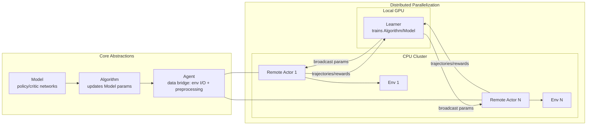

# PARL Architecture

```mermaid
%% PARL internal architecture (abstractions + parallelization)
flowchart LR

  %% Abstractions stack
  subgraph Abstractions[Core Abstractions]
    direction TB
    Model["Model<br/>policy/critic networks"]
    Algorithm["Algorithm<br/>updates Model params"]
    Agent["Agent<br/>data bridge: env I/O + preprocessing"]
    Model --> Algorithm --> Agent
  end

  %% Parallelization view
  subgraph Parallelization[Distributed Parallelization]
    direction LR

    subgraph LocalGPU[Local GPU]
      Learner["Learner<br/>trains Algorithm/Model"]
    end

    subgraph CPUCluster[CPU Cluster]
      direction LR
      Actor1[Remote Actor 1]
      ActorN[Remote Actor N]
      Env1[Env 1]
      EnvN[Env N]
      Actor1 --> Env1
      ActorN --> EnvN
    end

    Learner -- broadcast params --> Actor1
    Learner -- broadcast params --> ActorN
    Actor1 -- trajectories/rewards --> Learner
    ActorN -- trajectories/rewards --> Learner
  end

  %% Bridge between abstraction and parallelization views
  Agent --- Actor1
  Agent --- ActorN

```
